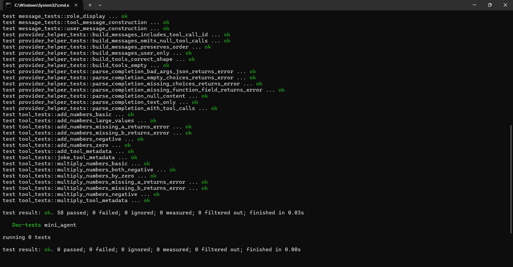

# Mini-Agent (Rust)


A **minimal, extensible AI agent framework** in Rust — composable, async-first, and designed for tool-integrated LLM workflows.

Mini-Agent focuses on predictable structure, simple abstractions, and clean separation of concerns between providers, agents, and tools.

Built for developers who want a Rust-native agent core without heavy frameworks or hidden complexity.

---

## Motivation

Modern AI agents rely on large language models *and* external tools to complete real-world tasks. Most Rust libraries in this space are either experimental, incomplete, or tightly coupled to specific providers.

Mini-Agent aims to provide:

- A clean and understandable agent loop
- A provider abstraction layer that actually works across 4 providers
- Structured error handling you can pattern match and build retry logic on top of
- JSON schema based tool interface
- Async-first design
- Extensibility without magic

This project prioritizes **clarity over cleverness** and **architecture over hype**.

---

## Installation

Add to your `Cargo.toml`:

```toml
[dependencies]
crates.io: `mini-agent = "0.1.0"`
```
---

## Quick Start

```rust
use mini_agent::{Agent, AddNumbersTool, OpenRouterProvider};
use std::env;

#[tokio::main]
async fn main() -> Result<(), Box<dyn std::error::Error>> {
    let api_key = env::var("OPENROUTER_API_KEY")?;
    let provider = OpenRouterProvider::new(api_key, "meta-llama/llama-3.1-8b-instruct");

    let mut agent = Agent::new(Box::new(provider), "meta-llama/llama-3.1-8b-instruct");
    agent.add_tool(AddNumbersTool);

    let result = agent.run("What is 42 + 58?").await?;
    println!("{}", result); // "100"

    Ok(())
}
```

---

## Defining a Custom Tool

```rust
use mini_agent::{AgentError, Tool};
use async_trait::async_trait;
use serde_json::{json, Value};

pub struct MultiplyTool;

#[async_trait]
impl Tool for MultiplyTool {
    fn name(&self) -> &'static str { "multiply_numbers" }

    fn description(&self) -> &'static str {
        "Multiplies two integers and returns the result"
    }

    fn parameters_schema(&self) -> Value {
        json!({
            "type": "object",
            "properties": {
                "a": { "type": "integer" },
                "b": { "type": "integer" }
            },
            "required": ["a", "b"],
            "additionalProperties": false
        })
    }

    async fn execute(&self, args: Value) -> Result<String, AgentError> {
        let a = args["a"].as_i64()
            .ok_or_else(|| AgentError::tool_exec(self.name(), "missing field 'a'"))?;
        let b = args["b"].as_i64()
            .ok_or_else(|| AgentError::tool_exec(self.name(), "missing field 'b'"))?;
        Ok((a * b).to_string())
    }
}
```

---

## Switching Providers

The agent is provider-agnostic. Swap any provider with zero changes to your agent or tool code:

```rust
// OpenRouter (free tier available)
let provider = OpenRouterProvider::new(api_key, "meta-llama/llama-3.1-8b-instruct");

// OpenAI
let provider = OpenAiProvider::new(api_key, "gpt-4o-mini");

// Anthropic (Claude)
let provider = AnthropicProvider::new(api_key, "claude-sonnet-4-20250514");

// Ollama (local, no API key needed)
let provider = OllamaProvider::new("llama3");
```

---

## Supported Providers

| Provider | Struct | Free Tier |
|----------|--------|-----------|
| OpenRouter | `OpenRouterProvider` | ✅ Yes |
| OpenAI | `OpenAiProvider` | ❌ Paid |
| Anthropic | `AnthropicProvider` | ❌ Paid |
| Ollama | `OllamaProvider` | ✅ Local |

---

## Error Handling

All errors are structured and pattern-matchable via `AgentError`:

```rust
match agent.run("Do something").await {
    Ok(answer) => println!("{}", answer),
    Err(AgentError::ToolNotFound(name)) => {
        eprintln!("Tool '{}' not registered — did you forget add_tool()?", name);
    }
    Err(AgentError::ToolExecution { tool, reason }) => {
        eprintln!("Tool '{}' failed: {}", tool, reason);
    }
    Err(AgentError::Provider { provider, message, status }) => {
        eprintln!("[{}] HTTP {:?}: {}", provider, status, message);
    }
    Err(AgentError::MaxSteps(n)) => {
        eprintln!("Agent gave up after {} steps", n);
    }
    Err(e) => eprintln!("Error: {}", e),
}
```

You can also use the built-in helpers for retry logic:

```rust
let err = agent.run("...").await.unwrap_err();

if err.is_retryable() {
    // safe to retry — 5xx or network error
}

if err.is_client_error() {
    // don't retry — bad API key, invalid request, etc.
}
```

---

## Agent Configuration

```rust
let mut agent = Agent::new(Box::new(provider), model)
    .with_system_prompt("You are a math assistant. Only use tools when necessary.")
    .with_max_steps(10); // default is 6
```

---

## Built-in Tools

| Tool | Name | Description |
|------|------|-------------|
| `AddNumbersTool` | `add_numbers` | Adds two integers |
| `MultiplyNumbersTool` | `multiply_numbers` | Multiplies two integers |
| `JokeTool` | `get_joke` | Fetches a random family-friendly joke |

---

## Architecture

### Core Traits

**`LlmProvider`** — Implement this to add a new LLM backend:
```rust
#[async_trait]
pub trait LlmProvider: Send + Sync {
    fn provider_name(&self) -> &str;
    async fn complete(&self, messages: &[Message], tools: &[&dyn Tool], model: &str)
        -> Result<Completion, AgentError>;
}
```

**`Tool`** — Implement this to add executable logic the agent can call:
```rust
#[async_trait]
pub trait Tool: Send + Sync + 'static {
    fn name(&self) -> &'static str;
    fn description(&self) -> &'static str;
    fn parameters_schema(&self) -> Value;
    async fn execute(&self, args: Value) -> Result<String, AgentError>;
}
```

### Execution Flow

```
User prompt
    │
    ▼
Agent sends messages + tools → LlmProvider
    │
    ▼
LLM responds with tool call?
    ├── Yes → execute tool → result added to context → loop
    └── No  → return final answer
```

---

## Testing

```bash
cargo test
```

Unit tests cover tool logic, message construction, agent configuration, provider helpers, and all error variants. Integration tests require a valid API key:

```bash
OPENROUTER_API_KEY=your_key cargo test --test integration
```

---

## CI

On every push and pull request, the pipeline runs:

```bash
cargo build && cargo test && cargo clippy
```

See [`.github/workflows/ci.yml`](.github/workflows/ci.yml) for details.

---

## Example Output



---

## Roadmap

- [ ] Memory / persistence layer
- [ ] Streaming response support
- [ ] Multi-agent orchestration
- [ ] Tool registry improvements
- [ ] `docs.rs` documentation pass

---

## Contributing

Contributions are welcome — new providers, tools, bug fixes, or documentation improvements. Open a PR with a clear description of your change.

---

## License

MIT — see [LICENSE](./LICENSE) for details.